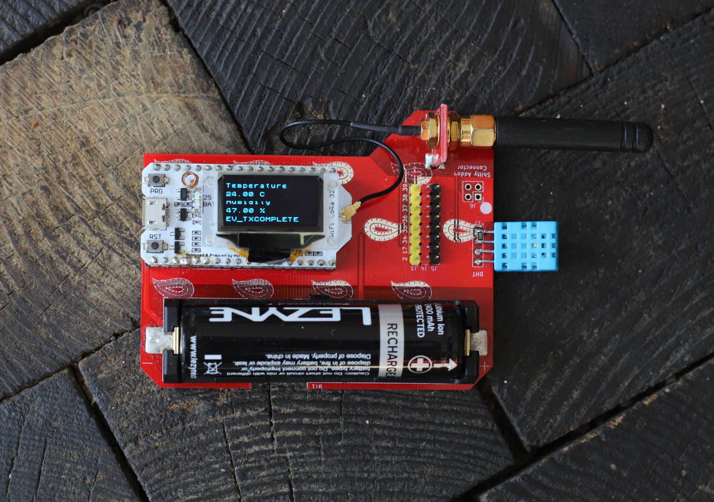

# LoRa32 Node

A simple breakoutboard / antenna mount for those cool, inexpensive Heltec LoRa32.

some examples can be found over there: https://github.com/morgulbrut/LoRa32_Workshop

## Features

 * DHT11 sensor.
 * 18650 battery holder.
 * Shitty Addon Connector.
 * Piece to break out and use as an antenna mount.
 * Designed in the Canton of Glarus.

## TODO/Problems

There are some different Versions around which aren't not totally pin compatible on some power pins.

 * DHT11 are super inaccurate, replace with at least DHT21.
 * Add some 0R on those incompatible pins.
 * Add battery measurement.
